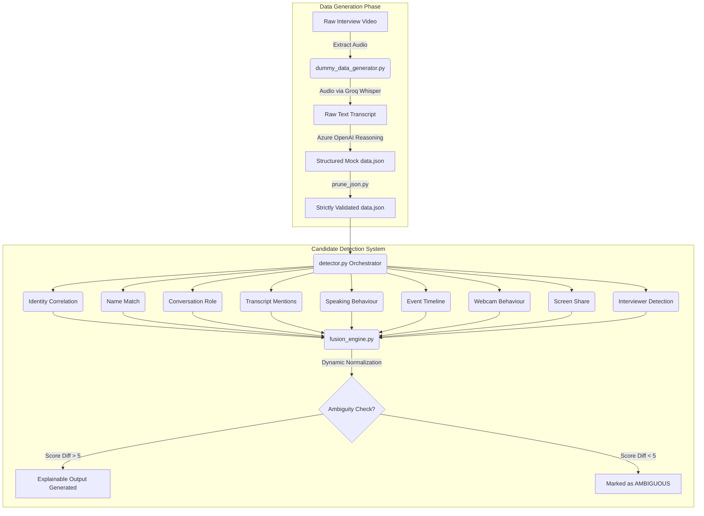

# SCIE: Smart Candidate Identification Engine

Welcome to **SCIE**, an intelligent pipeline designed to automatically evaluate and identify the target "Candidate" within an interview session using an Evidence Fusion Architecture and Large Language Models (LLMs). 

This project simulates a real-world analytics environment where video, audio, and participant metadata are processed to confidently determine who the candidate is among the participants, dynamically handling missing data without arbitrary penalties.

---

## How It Works: The Workflow

The SCIE system operates in two distinct phases: **Data Generation** (processing raw video into structured intelligence) and **Candidate Detection** (analyzing that intelligence using a dynamic, weighted Fusion Engine).



---

## Phase 1: Data Pipeline & Video Processing

The project starts with an actual interview video (`video/interview.mp4`). To analyze this, we extract structured data from the raw media.

1. **Audio Extraction & Transcription**:
   - We extract a lightweight `.mp3` from the video to bypass size limits.
   - We send the audio to **Groq's Whisper API (`whisper-large-v3`)** for hyper-fast, highly accurate transcription.
   
2. **Data Generation & Structuring**:
   - The raw transcript is passed to **Azure OpenAI's reasoning model (`gpt-5.5`)** to generate a comprehensive `data.json` file.
   - This JSON mimics an advanced web-RTC backend, structuring events like participant joins, screen sharing, webcam toggles, speaking ratios, and candidate calendar metadata.

---

## Phase 2: Candidate Detection Architecture

The core of SCIE is the `candidate_detector` pipeline. It processes `data.json` by running every participant through independent, non-blocking **Evidence Modules**. 

### Why Evidence Fusion?
Every available signal contributes evidence. Every module asks: *"Does this piece of evidence increase or decrease the probability that this participant is the candidate?"* If data is missing (like an email address), the module gracefully skips rather than crashing or penalizing.

### The Evidence Modules

1. **Conversation Role (`conversation_role.py`) - Weight: 25**
   - *How*: Feeds the transcript to **Azure OpenAI (`gpt-5.3-chat`)** to identify structured conversational dynamics: who asks questions, who answers, who introduces themselves, and who is evaluated.

2. **Transcript Mentions (`transcript_mentions.py`) - Weight: 15**
   - *How*: Uses an LLM to scan the transcript to see if a participant is repeatedly addressed by the known candidate's name.

3. **Speaking Behaviour (`speaking.py`) - Weight: 15**
   - *How*: Calculates total speaking duration, speaking ratio, number of turns, and average answer length to identify candidates responding to questions.

4. **Name Match (`name_match.py`) - Weight: 15**
   - *How*: Uses **RapidFuzz** for robust string matching, gracefully handling exact matches, partial names, typos, and initials against the calendar metadata.

5. **Identity Correlation (`identity_correlation.py`) - Weight: 15 (Dynamic)**
   - *How*: Compares participant emails or account IDs to the calendar invite. If identity information does not exist, the module skips completely.

6. **Event Timeline (`timeline.py`) - Weight: 5**
   - *How*: Merges all events (Join, Webcam, Speaking, Screen Share) chronologically to evaluate if a participant's timeline resembles a typical candidate sequence.

7. **Webcam Behaviour (`webcam.py`) - Weight: 5**
   - *How*: Evaluates camera uptime, stability, continuity, and toggles.

8. **Screen Share (`screen_share.py`) - Weight: 3**
   - *How*: Offers a minor confidence boost if a participant shares their screen. Never penalizes participants if no one shares.

9. **Interviewer Detection (`interviewer_detection.py`) - Penalty Module**
   - *How*: Heavily penalizes participants whose display names match known interviewers in the calendar metadata.

---

## The Dynamic Fusion Engine

The `FusionEngine` aggregates scores based on their assigned weights. 

**Dynamic Normalization**: 
If a module is skipped (e.g., no email available), its weight is excluded from the total normalization pool. This ensures that the final confidence score remains an accurate 0-100% metric based *only* on the available evidence.

**Explainability Engine**: 
The final output automatically generates an explanation detailing exactly *why* a participant was selected. Example output:
```
[+] Exact display name match: Chivukula Jagannath
[+] Participant shared screen 1 time(s).
[+] Speaking ratio 49.1% and average answer length (70.8s) strongly suggest candidate responding to questions.
```

**Ambiguity Handling:**
If the final scores of the top two participants are within 5 points of each other, the engine refuses to force a winner. It flags the decision as `AMBIGUOUS`, returning suggestions and highlighting the missing evidence modules.

## Tech Stack & Tools Used
- **Python 3.12+**: Core language using modular OOP architecture.
- **Pydantic**: Guarantees strict data validation and injects explainable `metadata` tags.
- **RapidFuzz**: Deterministic high-performance string matching.
- **Groq Whisper**: Audio transcription pipeline.
- **Azure OpenAI**: LLM semantic parsing and conversational logic reasoning.