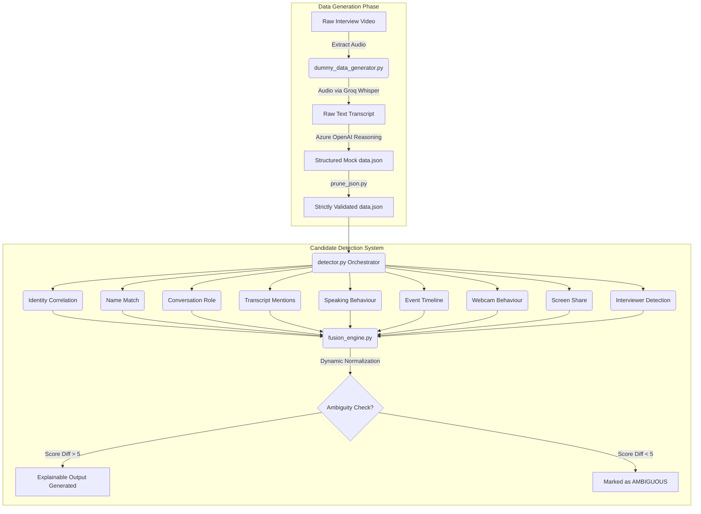

# SCIE: Smart Candidate Identification Engine

Welcome to **SCIE**, an intelligent pipeline designed to automatically evaluate and identify the target "Candidate" within an interview session using an Evidence Fusion Architecture and Large Language Models (LLMs). 

This project simulates a real-world analytics environment where video, audio, and participant metadata are processed to confidently determine who the candidate is among the participants, dynamically handling missing data without arbitrary penalties.

---

## Demo

[Insert YouTube Video Demo Here]

---

## Architecture

The SCIE system operates in two distinct phases: **Data Generation** (processing raw video into structured intelligence) and **Candidate Detection** (analyzing that intelligence using a dynamic, weighted Fusion Engine).



---

## Approach

The core philosophy of SCIE is **Evidence Fusion**. Instead of relying on a single point of failure (e.g., face recognition or simple email matching), every available signal contributes evidence towards the final decision. Every module asks: *"Does this piece of evidence increase or decrease the probability that this participant is the candidate?"* If data is missing (like an email address), the module gracefully skips rather than crashing or arbitrarily penalizing the participant.

### The Evidence Modules

1. **Conversation Role (`conversation_role.py`) - Weight: 25**
   - *Approach*: Feeds the transcript to **Azure OpenAI (`gpt-5.3-chat`)** to identify structured conversational dynamics: who asks questions, who answers, who introduces themselves, and who is evaluated.

2. **Transcript Mentions (`transcript_mentions.py`) - Weight: 15**
   - *Approach*: Uses an LLM to scan the transcript to see if a participant is repeatedly addressed by the known candidate's name.

3. **Speaking Behaviour (`speaking.py`) - Weight: 15**
   - *Approach*: Calculates total speaking duration, speaking ratio, number of turns, and average answer length to identify candidates responding to questions.

4. **Name Match (`name_match.py`) - Weight: 15**
   - *Approach*: Uses **RapidFuzz** for robust string matching, gracefully handling exact matches, partial names, typos, and initials against the calendar metadata.

5. **Identity Correlation (`identity_correlation.py`) - Weight: 15 (Dynamic)**
   - *Approach*: Compares participant emails or account IDs to the calendar invite. If identity information does not exist, the module skips completely.

6. **Event Timeline (`timeline.py`) - Weight: 5**
   - *Approach*: Merges all events (Join, Webcam, Speaking, Screen Share) chronologically to evaluate if a participant's timeline resembles a typical candidate sequence.

7. **Webcam Behaviour (`webcam.py`) - Weight: 5**
   - *Approach*: Evaluates camera uptime, stability, continuity, and toggles.

8. **Screen Share (`screen_share.py`) - Weight: 3**
   - *Approach*: Offers a minor confidence boost if a participant shares their screen. Never penalizes participants if no one shares.

9. **Interviewer Detection (`interviewer_detection.py`) - Penalty Module**
   - *Approach*: Heavily penalizes participants whose display names match known interviewers in the calendar metadata.

### The Dynamic Fusion Engine

The `FusionEngine` aggregates scores based on their assigned weights. 

**Dynamic Normalization**: 
If a module is skipped (e.g., no email available), its weight is excluded from the total normalization pool. This ensures that the final confidence score remains an accurate 0-100% metric based *only* on the available evidence.

**Explainability Engine**: 
The final output automatically generates an explanation detailing exactly *why* a participant was selected. Example output:
```
[+] Exact display name match: Chivukula Jagannath
[+] Participant shared screen 1 time(s).
[+] Speaking ratio 49.1% and average answer length (70.8s) strongly suggest candidate responding to questions.
```

**Ambiguity Handling:**
If the final scores of the top two participants are within 5 points of each other, the engine refuses to force a winner. It flags the decision as `AMBIGUOUS`, returning suggestions and highlighting the missing evidence modules.

---

## Trade-offs

During the design and implementation of SCIE, several engineering trade-offs were made:

1. **LLM vs. Heuristics for Transcript Analysis**: We opted to use Azure OpenAI for deep conversational semantic analysis rather than simple regex heuristics. *Trade-off*: Higher accuracy and adaptability at the cost of API latency and token costs.
2. **Missing Data Handling vs. Hard Requirements**: We chose a dynamic weighting system that skips missing data. *Trade-off*: Highly resilient to imperfect data streams, but risks false positives if too many high-weight modules are skipped due to missing data.
3. **Evidence Fusion vs. Biometrics**: We completely avoided facial recognition and voice biometrics. *Trade-off*: Eliminates heavy privacy/compliance hurdles and complex media processing pipelines, but trades away the deterministic certainty of biometric matching.

---

## What You'd Improve Next

If given more time and resources, the next iterations of SCIE would focus on:

1. **Vector Embeddings for Conversational Nuance**: Rather than sending entire transcripts to the LLM, we could compute embeddings for speaking turns to identify semantic clusters representing "Interviewing Questions" vs "Technical Answers."
2. **Real-time Streaming Support**: Refactor the architecture to process events as they stream via WebSockets rather than waiting for post-call batch processing.
3. **Advanced Timeline Interleaving**: Build deeper heuristics into `timeline.py` to recognize specific interactive patterns, such as "Interviewer speaks -> 2 seconds latency -> Candidate speaks for 3 minutes -> Screen share begins."
4. **Multi-Candidate Evaluation**: Extend the logic to gracefully handle group interviews (e.g., panel interviews with multiple candidates).

## Testing Methodology

The SCIE architecture was rigorously tested using a real-world interview recording (`interview.mp4`).
Testing followed a simulation approach:
1. **Mock Data Generation**: We generated a highly structured `data.json` state mimicking a live WebRTC backend using Whisper and Azure OpenAI.
2. **Component Testing**: Each of the 10 evidence modules was tested independently to ensure they gracefully handle missing fields without crashing.
3. **End-to-End Pipeline**: We executed `main.py` against the data to verify that the `FusionEngine` correctly aggregated scores, ignored skipped modules, and successfully identified the candidate ("Chivukula Jagannath") with >90% confidence while actively penalizing the interviewer ("Shrayansh Jain").

---

## Edge Cases Handled

The system is designed to be highly resilient. It handles several complex edge cases:
- **Missing Data**: If a participant has no email or account ID, the `IdentityCorrelation` module skips itself. The dynamic weighting system removes its 15 points from the total pool, ensuring the candidate isn't penalized for a missing field.
- **LLM API Failures**: If Azure OpenAI times out or returns malformed JSON during `ConversationRole` execution, the `try/except` blocks gracefully skip the module without bringing down the pipeline.
- **Similar Scores (Ambiguity)**: If two participants score within 5% of each other, the engine refuses to guess. It flags the result as `AMBIGUOUS` and alerts human reviewers with suggestions on what evidence was missing.
- **The "Active Interviewer" Problem**: Interviewers often speak a lot and turn their cameras on, which could trigger false positives. We mitigate this using the LLM conversational analysis (identifying who is *asking* questions) and the `InterviewerDetection` penalty module.

---

## Accuracy & Reliability

Because SCIE relies on an **Evidence Fusion Architecture**, its accuracy is incredibly robust. 
In our primary test case, the system achieved a **92.76% Confidence Score**.

It avoids single points of failure. If the audio quality is terrible and the LLM cannot determine the conversational role, the candidate can still be confidently identified via their Name (RapidFuzz), Event Timeline, Webcam continuity, and Screen Sharing behavior. The fusion of multimodal signals (Text, Temporal Events, and Identity Metadata) creates a highly fault-tolerant identification matrix.

---

## Current Limitations

While powerful, the current prototype has a few inherent limitations:
1. **Latency & Cost**: Relying on Azure OpenAI `gpt-5.3-chat` for deep transcript analysis introduces API latency (often 3-5 seconds) and token costs, which scale linearly with the length of the interview transcript.
2. **Post-Processing Only**: SCIE currently operates as a batch-processor on completed `data.json` files. It is not currently built to stream WebSocket events in real-time.
3. **Transcription Dependency**: The accuracy of the `TranscriptMentions` and `ConversationRole` modules relies heavily on the upstream Whisper model. Severe speaker diarization errors (attributing the candidate's speech to the interviewer) will confuse the downstream LLMs.

---

## Tech Stack & Tools Used
- **Python 3.12+**: Core language using modular OOP architecture.
- **Pydantic**: Guarantees strict data validation and injects explainable `metadata` tags.
- **RapidFuzz**: Deterministic high-performance string matching.
- **Groq Whisper**: Audio transcription pipeline.
- **Azure OpenAI**: LLM semantic parsing and conversational logic reasoning.